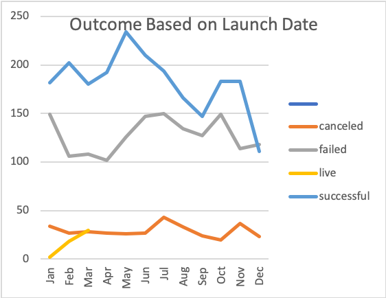
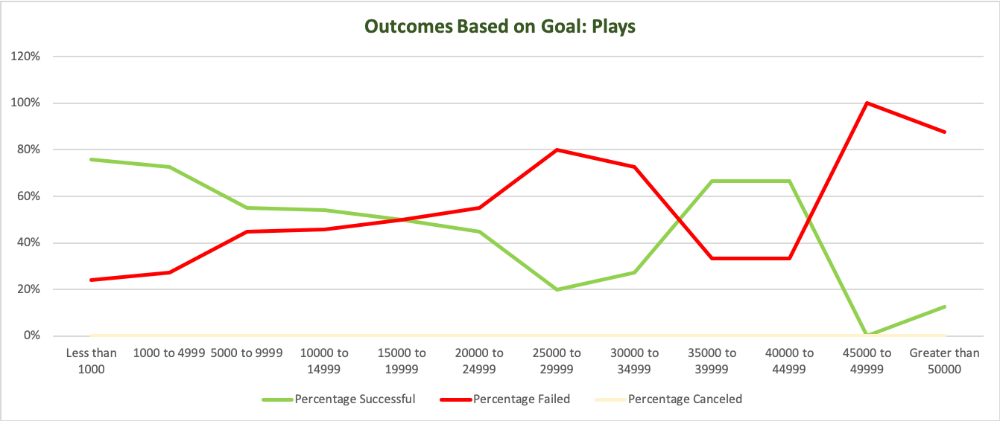
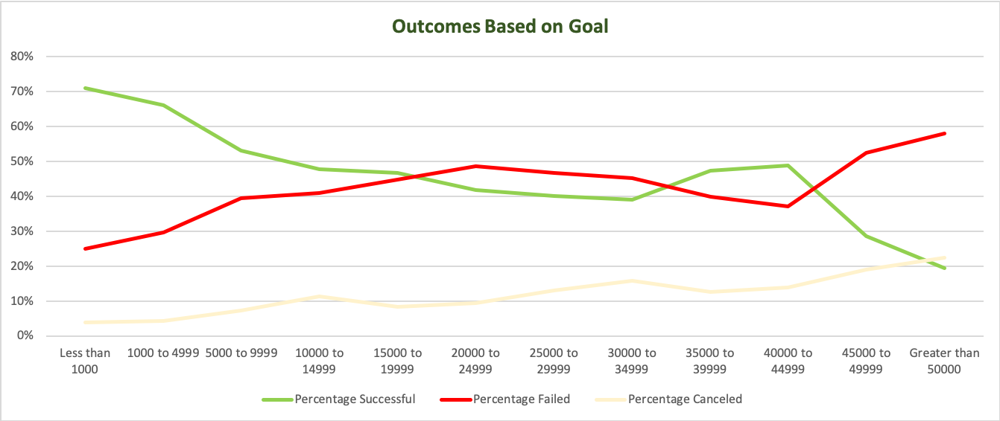
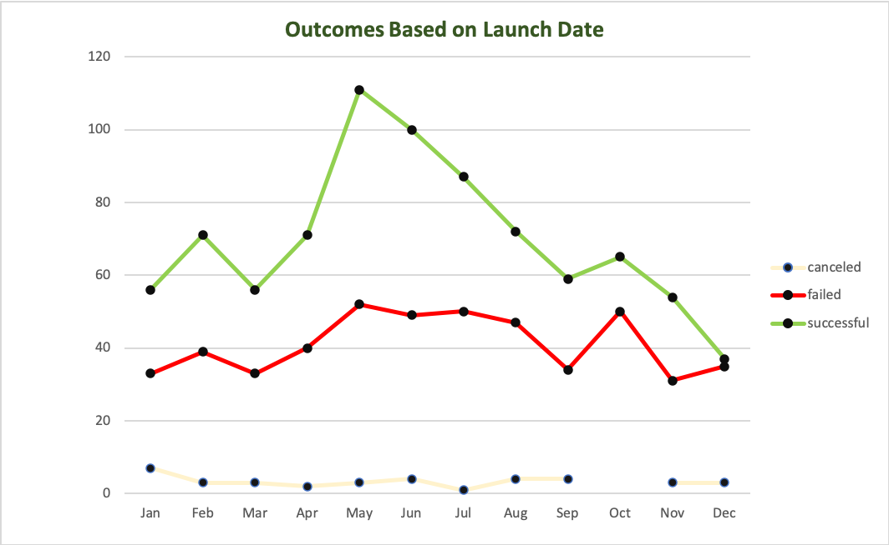

# An Analysis of Kickstarter Campaigns
Practice analysis of theater and play fundraising trends

# Successful vs Failed Kickstarters in the United States
A look at Category, Subcategory, and Timing

### Category: Theater 

Number of Successful Theater Campaigns - 525    
Number of Failed Theater Campaigns - 349

##### Theater Campaigns: Successful vs Failed

### Category: Plays
Number of Successful Plays Campaigns - 238  
Number of Failed Play Campaigns - 70

##### Plays Campaigns: Successful vs Failed

### Category: Timing

High Success Rate Launch Time - May to June     
Low Success Rate Launch Time -  November to December  

### Analysis:

* Theater fundraising campaigns have a significantly greater amount of successful campaigns compared to other parent groups like technology. 
* Within the the Theater category, the Plays subcategory has an even greater amount of successfull fundraising campaigns.
* The category and subcategory selected for soliciting support for this project are good categories and highly feasible.
* The best time to lauch the campaing would be May or June and the least ideal times would be November or December likely because of the holidays.

* Suggested further analysis could include a comparison of data from information on backers. Understanding the type of backers could help dicern those individuals or companies most likely to invest.
---

### Challenge

* The highest percentage of successful fundraising goals falls at 80% for those goals less than $1000. 
* Successful fundraising at the 60% or higher range are for goals up to $5000 and between $35,000 to $45,000. While failed fundraising campaigns are inverted, meaning the opposite of a successful campaign is the trend of the failed campaign.
* The relevance of these numbers is limited by effective launch dates not included in this chart. This means some other more important factor is at work.

* The inverted pattern of trend between successful and failed campaigns follows the same trend when not excluding for plays campaigns specifically.

* The successful and failed trends, with canceled trend being insignificant, reflect a more dynamic and informative pattern based on launch date.
* As stated previously the most successful play campaigns are initiated close to May or June.
* The highest fail rates are those campaigns initiated in October.

There is, however, no explanation for the plateau fail trend for those unsuccessful fundraisers initiated in May or June. An investigation into goal amount and type of backers for these would be helpful.
