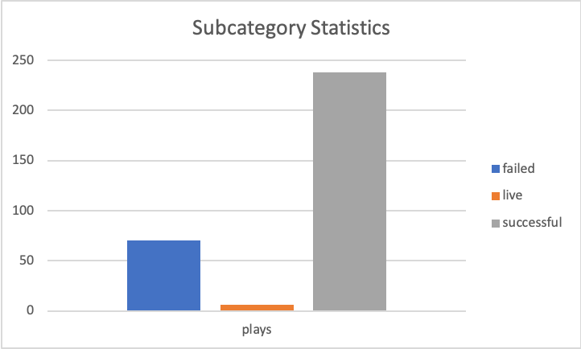

# An Analysis of Kickstarter Campaigns
Practice analysis of theater and play fundraising trends

# Successful vs Failed Kickstarters in the United States
A look at Category, Subcategory, and Timing

### Category: Theater 

Number of Successful Theater Campaigns - 525    
Number of Failed Theater Campaigns - 349

##### Theater Campaigns: Successful vs Failed

### Category: Plays
Number of Successful Plays Campaigns - 238  
Number of Failed Play Campaigns - 70

##### Plays Campaigns: Successful vs Failed

### Category: Timing

High Success Rate Launch Time - May to June     
Low Success Rate Launch Time -  November to December

### Analysis:

* Theater fundraising campaigns have a significantly greater amount of successful campaigns compared to other parent groups like technology. 
* Within the the Theater category, the Plays subcategory has an even greater amount of successfull fundraising campaigns.
* The category and subcategory selected for soliciting support for this project are good categories and highly feasible.
* The best time to lauch the campaing would be May or June and the least ideal times would be November or December likely because of the holidays.
---
